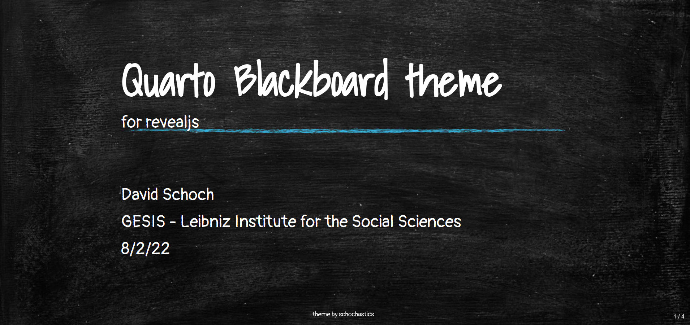
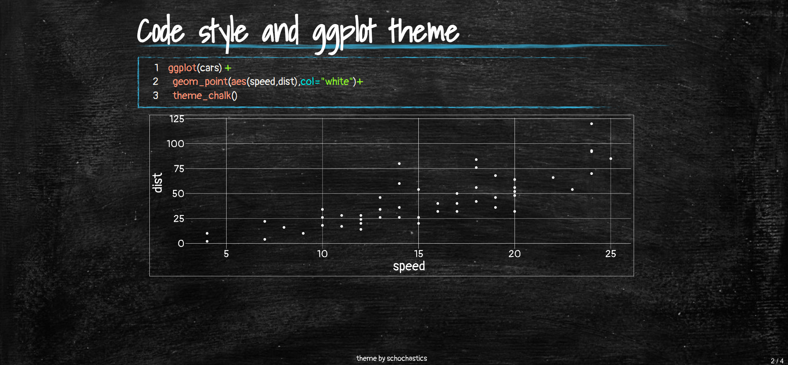
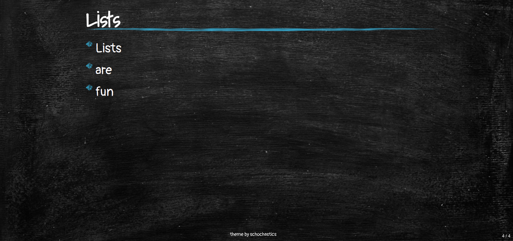

A port of my [xaringan blackboard theme](https://github.com/schochastics/xaringan-themes) for quarto/revealjs







## Installation

The template can be installed using the following command

```bash
quarto use template schochastics/quarto-blackboard-theme
```

Additionally, the `showtext` R package needs to be installed for the inbuilt ggplot theme to work.

```r
install.packages("showtext")
```

You can find more help in the `Quarto` documentation on [`reveal.js`](https://quarto.org/docs/presentations/revealjs/)
